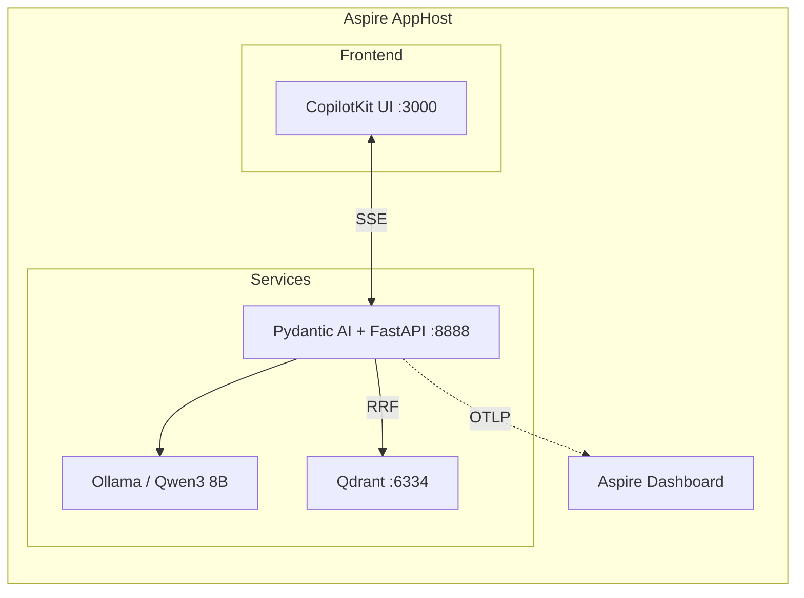
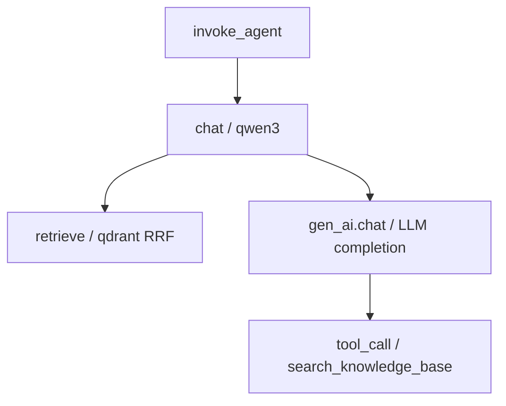

# Aspire Orchestration & Observability Setup

## Overview

Use [.NET Aspire](https://aspire.dev/) (v13+) as the orchestrator for the entire solution. Aspire provides:

- Single `dotnet run` to spin up all services
- Unified dashboard for logs, traces, metrics
- Service discovery (no hardcoded ports)
- Health checks for all resources
- Built-in OpenTelemetry (OTLP) collector

## Architecture



## AppHost Configuration

```csharp
var builder = DistributedApplication.CreateBuilder(args);

var ollama = builder.AddOllama("ollama")
    .WithLifetime(ContainerLifetime.Persistent)
    .AddModel("qwen3");

var qdrant = builder.AddQdrant("qdrant")
    .WithLifetime(ContainerLifetime.Persistent);

var agent = builder.AddUvicornApp("agent", "../src/agent", "main:app")
    .WithHttpEndpoint(port: 8888)
    .WithReference(ollama)
    .WithReference(qdrant);

await builder.Build().RunAsync();
```

### NuGet Packages (AppHost)

```xml
<PackageReference Include="Aspire.Hosting" />
<PackageReference Include="Aspire.Hosting.Python" />
<PackageReference Include="Aspire.Hosting.Qdrant" />
<PackageReference Include="CommunityToolkit.Aspire.Hosting.Ollama" />
```

### Python Dependencies (agent)

```txt
pydantic-ai-slim[ag-ui]
fastapi
uvicorn
qdrant-client
sentence-transformers
crawl4ai
opentelemetry-distro
opentelemetry-exporter-otlp-proto-grpc
opentelemetry-instrumentation-fastapi
```

## Observability

### Three Pillars via Aspire

Aspire automatically sets `OTEL_EXPORTER_OTLP_ENDPOINT` for all managed resources. The Python agent sends traces, metrics, and logs to the Aspire Dashboard via OTLP/gRPC.

| Pillar | What's captured |
|--------|-----------------|
| **Traces** | Agent runs, LLM calls, tool invocations, retrieval spans |
| **Metrics** | Token usage, latency, request counts |
| **Logs** | Uvicorn logs, agent logs, structured events |

### OpenTelemetry GenAI Semantic Conventions

We follow the [OTel GenAI Semantic Conventions](https://opentelemetry.io/docs/specs/semconv/gen-ai/) — the industry standard for AI observability.

#### Agent Spans (`gen_ai.*`)

| Attribute | Description |
|-----------|-------------|
| `gen_ai.operation.name` | `create_agent`, `invoke_agent`, `chat` |
| `gen_ai.agent.name` | Human-readable agent name |
| `gen_ai.agent.id` | Unique agent identifier |
| `gen_ai.request.model` | Model used (e.g., `qwen3`) |
| `gen_ai.usage.input_tokens` | Tokens in prompt |
| `gen_ai.usage.output_tokens` | Tokens in response |
| `gen_ai.conversation.id` | Conversation thread ID |
| `gen_ai.request.temperature` | Temperature setting |

#### Span Hierarchy



#### Coverage Areas

| Convention | Scope |
|------------|-------|
| [Agent Spans](https://opentelemetry.io/docs/specs/semconv/gen-ai/gen-ai-agent-spans/) | Agent creation, invocation, lifecycle |
| [Client Spans](https://opentelemetry.io/docs/specs/semconv/gen-ai/gen-ai-spans/) | LLM chat/completion calls |
| [Metrics](https://opentelemetry.io/docs/specs/semconv/gen-ai/gen-ai-metrics/) | Token usage, latency, error rates |

### Pydantic AI + Logfire (OpenTelemetry)

Pydantic AI has built-in support for [Logfire](https://github.com/pydantic/logfire) — an OTel-native observability SDK. Since Logfire is built on OpenTelemetry, it exports to **any OTLP backend** including the Aspire Dashboard.

```python
import logfire

logfire.configure(
    send_to_logfire=False,  # use OTLP exporter only
)
logfire.instrument_pydantic_ai()
logfire.instrument_fastapi(app)
```

This gives us:
- LLM call traces with token counts
- Tool call spans with arguments/results
- Agent invocation hierarchy
- All flowing into Aspire Dashboard

### Python OTel Bootstrap

```python
from opentelemetry import trace
from opentelemetry.sdk.trace import TracerProvider
from opentelemetry.sdk.trace.export import BatchSpanProcessor
from opentelemetry.exporter.otlp.proto.grpc.trace_exporter import OTLPSpanExporter
from opentelemetry.instrumentation.fastapi import FastAPIInstrumentor

provider = TracerProvider()
provider.add_span_processor(
    BatchSpanProcessor(OTLPSpanExporter())  # OTEL_EXPORTER_OTLP_ENDPOINT set by Aspire
)
trace.set_tracer_provider(provider)
FastAPIInstrumentor.instrument_app(app)
```

## Key References

- [Aspire Telemetry](https://learn.microsoft.com/en-us/dotnet/aspire/fundamentals/telemetry)
- [Aspire + Python OTel](https://learn.microsoft.com/en-us/dotnet/aspire/get-started/build-aspire-apps-with-python)
- [Aspire Dashboard for Python](https://tonybaloney.github.io/posts/using-dotnet-aspire-dashboard-for-python-opentelemetry.html)
- [OTel GenAI Semantic Conventions](https://opentelemetry.io/docs/specs/semconv/gen-ai/)
- [OTel GenAI Agent Spans](https://opentelemetry.io/docs/specs/semconv/gen-ai/gen-ai-agent-spans/)
- [AI Agent Observability Blog](https://opentelemetry.io/blog/2025/ai-agent-observability/)
- [Pydantic Logfire](https://github.com/pydantic/logfire)
- [Aspire Ollama Integration](https://learn.microsoft.com/en-us/dotnet/aspire/community-toolkit/ollama)
