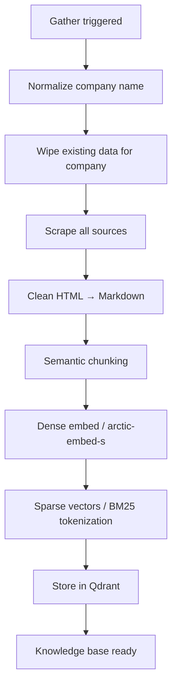
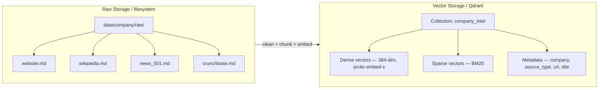

# Data Strategy

## Scraping Lifecycle

### POC Approach: Fresh Gather

Each gather run is **idempotent** — re-running for the same company wipes previous data and produces identical results for identical content (FR-2, NFR-5).



> **Future improvement**: content hash + TTL hybrid for incremental updates (skip unchanged pages, re-scrape only stale sources).

### Scraping Bounds

Per [constraints.md](./constraints.md):

| Constraint            | Value                           |
| --------------------- | ------------------------------- |
| Max pages per source  | 20                              |
| Max raw document size | 100 KB (text)                   |
| Request timeout       | 30s per page                    |
| Rate limit            | 1 req/s per domain              |
| Retry policy          | 3 attempts, exponential backoff |
| Robots.txt            | Respect always                  |
| Allowed content types | text/html only                  |

### Text Cleaning

| Constraint          | Value                                     |
| ------------------- | ----------------------------------------- |
| Remove              | nav, footer, sidebar, cookie banners, ads |
| Min document length | 100 characters after cleaning             |
| Max document length | 50,000 characters (truncate)              |
| Encoding            | UTF-8, NFC normalization                  |
| Language filter      | English only — discard non-English pages  |

## Data Model

### Raw Document

```python
class RawDocument(BaseModel):
    url: str
    title: str
    content: str  # clean Markdown (UTF-8, NFC)
    source_type: Literal["website", "wikipedia", "news", "crunchbase"]
    company: str  # normalized name
    scraped_at: datetime
```

### Chunk (stored in Qdrant)

```python
class Chunk(BaseModel):
    id: str  # sha256(url + chunk_index) — deterministic
    text: str
    metadata: ChunkMetadata

class ChunkMetadata(BaseModel):
    url: str           # citation
    title: str         # citation
    company: str       # indexed, filterable
    source_type: str   # indexed, filterable
    chunk_index: int
    scraped_at: datetime
```

## Storage Layout



- **Raw files** kept for reproducibility and debugging (NFR-5)
- **Single Qdrant collection** `company_intel`, filtered by `company` metadata via pre-search filtering
- **Dual vectors** per chunk: dense (384-dim, `snowflake-arctic-embed-s`) + sparse (BM25) for hybrid search via RRF fusion
- **Indexed metadata fields**: `company`, `source_type` — required for pre-search filtering

## Chunking Strategy

### Semantic Chunking

| Parameter           | Value                            |
| ------------------- | -------------------------------- |
| Strategy            | Semantic (heading/paragraph)     |
| Target chunk size   | 256–512 tokens                   |
| Hard max chunk size | 512 tokens                       |
| Min chunk size      | 50 tokens                        |
| Overlap             | 50 tokens between adjacent chunks|
| Split hierarchy     | H1 > H2 > H3 > paragraph > sentence |

### Metadata per Chunk

Every chunk carries enough metadata to:

1. **Cite** — `url`, `title` (FR-5: source citations in every answer)
2. **Filter** — `company`, `source_type` (FR-4: support filtering)
3. **Trace** — `scraped_at`, `chunk_index` (NFR-5: reproducibility)

## Embedding Pipeline

| Parameter        | Value                      |
| ---------------- | -------------------------- |
| Model            | `snowflake-arctic-embed-s` |
| Dimensionality   | 384                        |
| Max input tokens | 512                        |
| Normalization    | L2-normalize               |
| Batch size       | 64 chunks                  |
| Device           | CPU (GPU optional)         |
| Deterministic    | Same text → same embedding |

Sparse vectors generated via BM25 tokenization for each chunk, stored alongside dense vectors in Qdrant.

## Retrieval Flow

```
User query → dense embed + BM25 tokenize
  → optional company filter (inferred by LLM from context)
  → Qdrant prefetch: top-20 dense + top-20 sparse
  → RRF fusion (k=60) → top-10
  → similarity threshold filter (cosine ≥ 0.3)
  → ≤ 4,000 tokens retrieved context → LLM
```

| Parameter            | Value                              |
| -------------------- | ---------------------------------- |
| Top-k                | 8–10 chunks per query              |
| Company filter       | Optional, inferred by LLM          |
| Similarity threshold | 0.3 minimum cosine similarity      |
| Context budget       | ≤ 4,000 tokens total retrieved text|

When no chunks pass the threshold → "I don't have enough information about that."

## Data Deletion

On new gather for the same company (idempotent re-scrape):

1. Delete raw files: `rm data/{company}/raw/*`
2. Delete Qdrant points: filter by `company` metadata and delete
3. Re-scrape from scratch

## Volume Bounds (POC)

| Metric                   | Value          |
| ------------------------ | -------------- |
| Target companies         | 5–20           |
| Raw documents per company| ~50–200        |
| Chunks per company       | ~500–5,000     |
| Total vector store       | < 100K chunks  |

## Requirements Traceability

| Requirement | Covered By |
|-------------|------------|
| FR-1 (company input normalization) | Normalize step in gather flow |
| FR-2 (data gathering, idempotent) | Fresh gather lifecycle, scraping bounds |
| FR-3 (text processing pipeline) | Text cleaning → chunking → embedding pipeline |
| FR-4 (knowledge base, filtering) | Single Qdrant collection, indexed metadata |
| FR-5 (citations) | ChunkMetadata: url, title |
| NFR-1 (offline) | Local embeddings (sentence-transformers), local Qdrant |
| NFR-2 (English only) | Language filter in text cleaning |
| NFR-3 (latency) | Embedding < 500ms/chunk, retrieval < 200ms |
| NFR-4 (data volume) | Volume bounds table |
| NFR-5 (reproducibility) | Deterministic chunk IDs, raw files preserved, deterministic embeddings |
| NFR-6 (modularity) | Scraper, chunker, embedder, vector store each independent |
