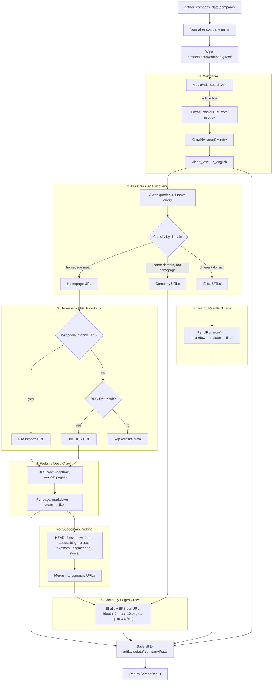
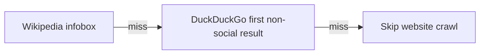
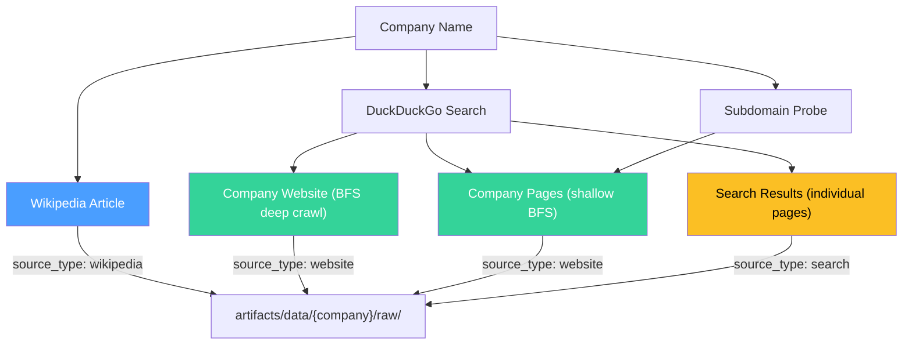
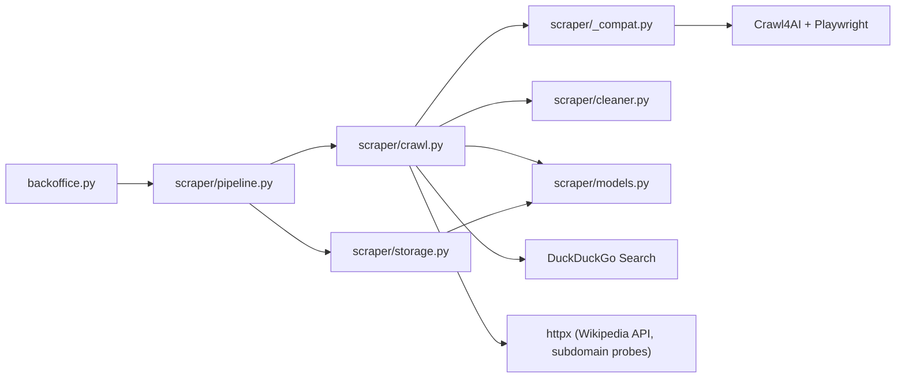
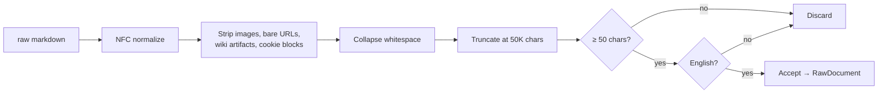
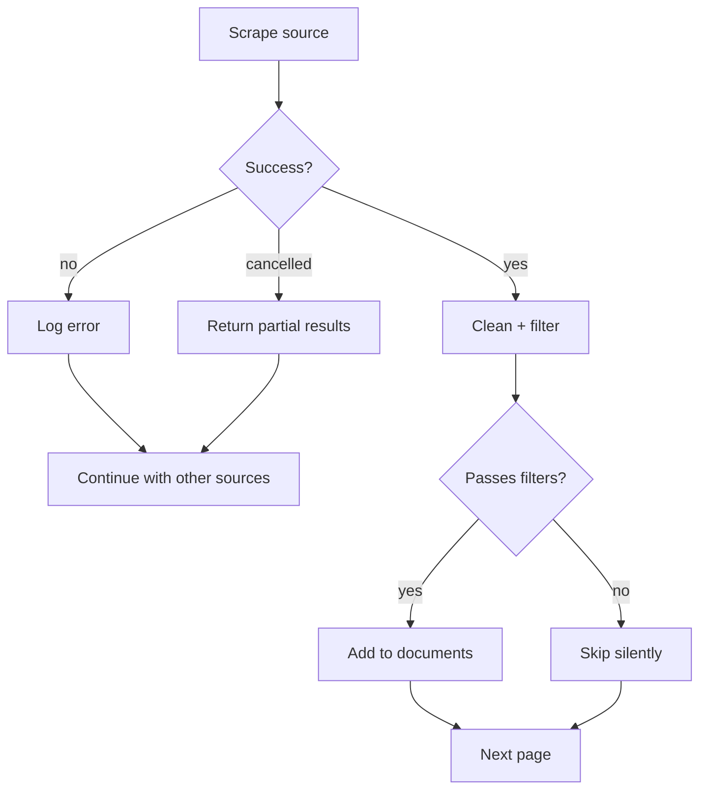

# Scraper Implementation

## Overview

The scraper pipeline gathers raw company data from multiple source types — Wikipedia, the company's official website, company subpages (newsroom, blog, investors), and third-party content via DuckDuckGo search. It produces clean Markdown files stored locally. Triggered by the backoffice agent's `gather_company_data` tool.

## Strategy & Motivation

**Why multi-source?** No single source gives a complete picture. Wikipedia provides structured facts (founding date, HQ, revenue), official website pages describe products and mission, and news/blog articles capture recent events and external perspectives. Together these give the RAG system enough material for diverse questions.

**Why BFS crawling?** Breadth-first is predictable — we get the most linked (most important) pages first. Best-first with relevance scoring is a future improvement but adds complexity and heuristic tuning.

**Why subdomain probing?** DuckDuckGo web search for large companies (Spotify, Google) returns almost exclusively social media profiles and Wikipedia — all filtered out. News search returns mostly MSN aggregator wrappers that yield no usable content. Probing common subdomains (`newsroom.`, `about.`, `investors.`) discovers high-value company pages that search engines don't surface.

**Why Windows compat layer?** Uvicorn uses `SelectorEventLoop` on Windows which lacks subprocess support needed by Playwright/Chromium. The `_compat.py` module runs browser operations in a separate thread with `ProactorEventLoop`, propagating OpenTelemetry context across the thread boundary.

## Pipeline Flow



## URL Discovery Strategy

### Homepage Resolution (2-step fallback)



| Step | Source | Method |
|------|--------|--------|
| 1 | Wikipedia infobox | Parse `action=parse` API response for `class="url"` link |
| 2 | DuckDuckGo | First non-social result from multi-query search |

### DuckDuckGo Multi-Query Search

Three web queries diversify results:

| Query | Purpose |
|-------|---------|
| `{company} company` | General results |
| `{company} about company overview` | About/profile pages |
| `{company} company news products` | Product and news pages |

Plus one news query: `{company} company` via `DDGS.news()`.

Results are deduplicated across queries, filtered to skip useless domains, then classified:

- **Homepage URL** — same domain, root path (e.g. `spotify.com/`)
- **Company URLs** — same domain, non-root path (e.g. `newsroom.spotify.com/2024/...`) — sorted with about/newsroom/press pages first
- **Extra URLs** — different domain (third-party news, blog posts, analyses)

### Subdomain Probing

DDG often can't surface company subdomains. After resolving the homepage domain, we HEAD-check common subdomains and add any that respond (HTTP < 400, same root domain after redirects) to company URLs:

`newsroom.`, `about.`, `blog.`, `press.`, `investors.`, `engineering.`, `news.`

### Skipped Domains

URLs from these domains are filtered from search results (no useful scraping content):

`wikipedia.org`, `youtube.com`, `facebook.com`, `twitter.com`, `x.com`, `instagram.com`, `linkedin.com`, `tiktok.com`, `reddit.com`, `msn.com`

**Why MSN?** MSN is a news aggregator that wraps original articles behind heavy JavaScript. Headless browser scraping yields 1-280 chars — unusable. Skipping MSN lets us spend our scraping budget on sources that actually render.

## URL Deduplication

A `seen_urls: set[str]` tracks every URL processed across all pipeline steps. This prevents:

- **Website BFS → company pages overlap**: Homepage BFS at depth=2 may discover `/about`, `/newsroom`. Without dedup, step 5 would re-scrape them.
- **Company pages cross-session overlap**: BFS from `/about` might discover `/newsroom` link. The shared `seen_urls` set is passed into `scrape_company_pages` and updated as each page is visited.
- **Search results overlap**: Extra URLs are filtered against `seen_urls` before scraping.

## Data Sources



| Source | Method | Max pages | source_type |
|--------|--------|-----------|-------------|
| Wikipedia | MediaWiki API search → single page crawl with retry | 1 | `wikipedia` |
| Company website | BFS deep crawl from homepage (depth=2) | 20 | `website` |
| Company pages | Shallow BFS from up to 3 company URLs (depth=1) | 10 per URL | `website` |
| Search results | DDG web + news results, scraped individually | 20 | `search` |

## Module Structure



```
src/agent/agent/scraper/
    __init__.py       — re-exports scrape_company
    models.py         — RawDocument, ScrapeResult, WikipediaResult, SearchResults
    cleaner.py        — clean_text(), is_english()
    crawl.py          — Crawl4AI config, scrape_website(), scrape_company_pages(),
                        scrape_wikipedia(), search_company(), scrape_search_results(),
                        probe_company_subdomains()
    storage.py        — save_raw_documents(), wipe_raw_data(), list_companies()
    pipeline.py       — scrape_company() orchestrator
    _compat.py        — Windows asyncio compat (ProactorEventLoop in thread)
```

## Crawl4AI Configuration

### Shared Settings

All crawl configs share these base settings:

| Setting | Value | Rationale |
|---------|-------|-----------|
| `BrowserConfig` | `headless=True` | Full JS rendering — required for SPAs |
| `scraping_strategy` | `LXMLWebScrapingStrategy` | Fast HTML parsing |
| `markdown_generator` | `DefaultMarkdownGenerator(ignore_links=True)` | Clean text for RAG, no noisy link URLs |
| `excluded_tags` | nav, footer, header, aside, form | Boilerplate removal at DOM level |
| `check_robots_txt` | `True` | Always respect |
| `page_timeout` | 30,000 ms | Fail fast |
| `cache_mode` | `BYPASS` | Fresh scrape each run (idempotent) |

### Website Deep Crawl (step 4)

| Setting | Value |
|---------|-------|
| `max_depth` | 2 (seed + 2 levels) |
| `max_pages` | 20 |
| `include_external` | `False` (stay on-domain) |
| `filter_chain` | `ContentTypeFilter(text/html)` |
| `mean_delay` | 1.0s (± 0.5s jitter) |

### Company Pages Shallow Crawl (step 5)

| Setting | Value |
|---------|-------|
| `max_depth` | 1 (seed + 1 level) |
| `max_pages` | 10 per URL |
| Up to | 3 seed URLs |
| `mean_delay` | 1.0s (± 0.5s jitter) |

### Wikipedia Scrape (step 1)

| Setting | Value | Notes |
|---------|-------|-------|
| `css_selector` | `div#mw-content-text` | Article body only |
| `excluded_selector` | `.reflist, .navbox, .hatnote, .sidebar, .infobox` | Noise removal |
| Retry | 3 attempts, exponential backoff | Manual — `arun()` has no built-in retry |

### Search Results Scrape (step 6)

| Setting | Value | Notes |
|---------|-------|-------|
| Deep crawl | None | Single page per URL |
| Max URLs | 20 | Capped to bound total time |
| Per-URL timeout | 45s | `asyncio.wait_for` |
| Batch timeout | 300s (5 min) | Outer `asyncio.wait_for` |
| Inter-page delay | 1.0s | Polite, sequential |

## Text Cleaning

Post-crawl filters in `cleaner.py`. Crawl4AI handles boilerplate at DOM level (`excluded_tags`); these filters handle remaining noise in the markdown output:



| Filter | Pattern | Purpose |
|--------|---------|---------|
| Markdown images | `!\[...\](...)` | Images add no text value |
| Bare URLs | `https?://...` (not in links) | URL noise outside markdown links |
| Wikipedia `[edit]` | `\[edit\]` | Section edit buttons |
| Wikipedia citations | `\[\d+\]` | Inline reference numbers |
| "Skip to main content" | Exact line match | Accessibility nav artifact |
| Slide indicators | `Slide N of N` | Carousel UI text |
| Cookie blocks | `### Cookie policy/settings...` | Cookie consent sections |
| Whitespace collapse | `\n{3,}` → `\n\n`, `[ \t]{2,}` → ` ` | Clean formatting |
| Unicode NFC | `unicodedata.normalize("NFC")` | Consistent tokenization |
| Max length | Truncate at 50,000 chars | Bound outlier pages |
| Min length | Skip if < 50 chars | Discard near-empty pages |
| Language | `langdetect.detect() == "en"` | English-only corpus |

## Data Model

```python
SourceType = Literal["website", "wikipedia", "search"]

class RawDocument(BaseModel):
    url: str                      # source URL for citation
    title: str                    # page title
    content: str                  # clean Markdown (UTF-8, NFC)
    source_type: SourceType       # indexed, filterable
    company: str                  # normalized name
    scraped_at: datetime          # scrape timestamp

class ScrapeResult(BaseModel):
    company: str
    website_pages: int
    search_pages: int
    wikipedia_scraped: bool
    total_documents: int
    errors: list[str]

@dataclass
class SearchResults:
    homepage_url: str | None
    company_urls: list[str]       # same domain, non-homepage
    extra_urls: list[str]         # third-party content
```

## Output Format

```
artifacts/data/{company}/raw/
    wikipedia.md
    website_001.md  ...  website_NNN.md
    search_001.md   ...  search_NNN.md
```

Each file includes YAML frontmatter:

```markdown
---
url: https://newsroom.spotify.com/2024-wrapped
title: Spotify 2024 Wrapped
source_type: website
company: spotify
scraped_at: 2026-02-21T14:30:00Z
---

# Spotify 2024 Wrapped
...
```

## Error Handling



| Scenario | Behavior |
|----------|----------|
| Website unreachable / timeout | Log, return empty. Pipeline continues with other sources. |
| Wikipedia 404 | Return `None`. Pipeline continues with website + search. |
| DuckDuckGo search fails | No extra URLs. Pipeline continues with Wikipedia. |
| robots.txt blocks URL | Skip URL, log as error. |
| Individual page fails | Skip page, continue with remaining. |
| `CancelledError` (request cancelled) | Caught per-source, return partial results collected so far. |
| Batch timeout (300s) | Search results scrape stops, returns what it has. |
| All sources fail | `ScrapeResult(total_documents=0, errors=[...])` |
| Non-English page | Silently skipped. |
| Page too short (< 50 chars) | Silently skipped. |
| Browser crash | Caught, logged. Empty result for that source. |
| Subdomain probe fails | Silently skipped (DNS, connection, SSL errors are expected). |

Partial success is OK — errors are collected in `ScrapeResult.errors` and reported to the user.

## Windows Compatibility

Uvicorn on Windows uses `SelectorEventLoop` which cannot spawn subprocesses. Playwright (used by Crawl4AI) needs subprocesses to launch Chromium. The `_compat.py` module bridges this:

1. A `ThreadPoolExecutor(max_workers=2)` runs browser operations in dedicated threads
2. Each thread creates a `ProactorEventLoop` (Windows) or standard event loop (Linux/macOS)
3. OpenTelemetry context is propagated across the thread boundary via `otel_context.attach/detach`

All browser calls go through `run_in_crawler_thread(fn)` which handles this transparently.

## Dependencies

| Package | Purpose |
|---------|---------|
| `crawl4ai` | Web scraping with Playwright browser, Markdown output, BFS deep crawl |
| `langdetect` | Post-crawl English language detection |
| `duckduckgo-search` | Company discovery + content sourcing (free, no API key) |
| `httpx` | Wikipedia MediaWiki API calls, subdomain probing |

## Idempotency

Re-running `gather_company_data("figma")` wipes `artifacts/data/figma/raw/` first, then re-scrapes from scratch. Same content produces identical files (deterministic filenames, consistent cleaning).
