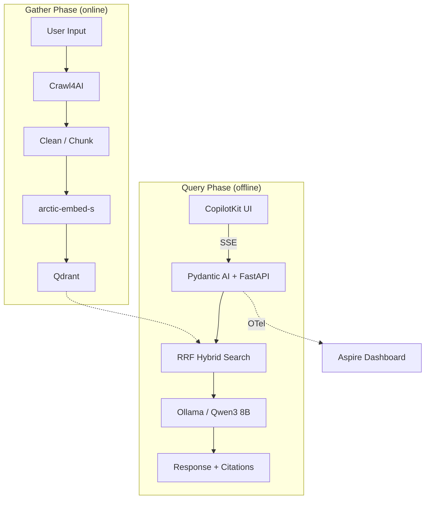
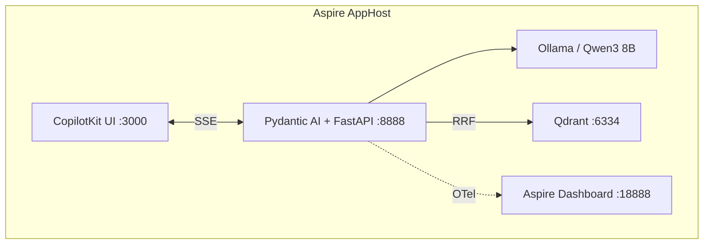

# Reference — Existing Solutions & Best Practices

## Existing Solutions

### OSINT / Company Research Tools

| Tool         | Description                                                       | Link                                                      |
| ------------ | ----------------------------------------------------------------- | --------------------------------------------------------- |
| LLM OSINT    | PoC using LLMs to gather info from the internet and perform tasks | [GitHub](https://github.com/sshh12/llm_osint)             |
| SpiderFoot   | OSINT automation with 200+ modules for company recon              | [GitHub](https://github.com/smicallef/spiderfoot)         |
| theHarvester | Company external threat landscape gathering                       | [GitHub](https://github.com/laramies/theHarvester)        |
| LinkScope    | Graphical OSINT link analysis tool                                | [GitHub](https://github.com/AccentuSoft/LinkScope_Client) |

### RAG Frameworks

| Tool         | Description                                    | Link                                             |
| ------------ | ---------------------------------------------- | ------------------------------------------------ |
| RAGFlow      | Deep document understanding + RAG engine       | [GitHub](https://github.com/infiniflow/ragflow)  |
| R2R          | Production-ready RAG with multi-step reasoning | [GitHub](https://github.com/SciPhi-AI/R2R)       |
| Haystack     | Modular RAG pipelines in Python (deepset)      | [GitHub](https://github.com/deepset-ai/haystack) |
| RAG-Anything | Multimodal RAG (tables, diagrams, text)        | [GitHub](https://github.com/HKUDS/RAG-Anything)  |
| Cognita      | Customizable RAG with UI for testing           | [GitHub](https://github.com/truefoundry/cognita) |

### Web Scraping for LLMs

| Tool        | Description                                                    | Link                                                 |
| ----------- | -------------------------------------------------------------- | ---------------------------------------------------- |
| Crawl4AI    | Open-source, LLM-friendly crawler, Markdown output, free       | [GitHub](https://github.com/unclecode/crawl4ai)      |
| Firecrawl   | Cloud API, Markdown output, LangChain integration ($29+/mo)    | [firecrawl.dev](https://www.firecrawl.dev/)          |
| LLM Scraper | Structured data extraction from webpages via LLMs (TypeScript) | [GitHub](https://github.com/mishushakov/llm-scraper) |

---

## Best Practices

### 1. Data Collection Layer

- **Multi-source ingestion**: company website, Wikipedia, Crunchbase, news APIs, SEC filings, GitHub
- Use **Crawl4AI** (free, Markdown-native) or **Firecrawl** for scraping
- Respect `robots.txt`, rate-limit, retry with exponential backoff
- Store raw data separately from processed data for reproducibility

### 2. Processing & Chunking

- Convert to **clean Markdown** — most token-efficient for LLMs
- Use **semantic chunking** (not fixed-size) to preserve context boundaries
- Extract metadata per chunk: source URL, scrape date, content type
- Enforce schema contracts with **Pydantic models**

### 3. Vector Store / Knowledge Base

- **Qdrant** for vector storage — pre-search filtering, hybrid search (BM25 + dense via RRF), first-party Aspire integration
- Embed with local model (`sentence-transformers`, `snowflake-arctic-embed-s`) for offline use
- Store both dense + sparse (BM25) vectors per chunk for hybrid retrieval
- Store original text + metadata for retrieval + citation
- Single collection with optional metadata filtering by company

### 4. RAG Pipeline

- Use **Pydantic AI** agents with tool-based retrieval from Qdrant
- **Hybrid search** via RRF: `RRF_score(doc) = 1/(k + rank_dense) + 1/(k + rank_bm25)` with k=60
- Qdrant prefetch: top-20 dense + top-20 sparse → RRF fusion → top-10 → LLM context
- Optional company filter inferred by LLM from conversation context
- Include **source citations** in every answer
- **Reranker deferred** — add when retrieval quality is measurably insufficient

### 5. Chat Interface

- Local LLM via **Ollama** (Qwen3 8B, Q4_K_M) for fully offline chat — 32K context window
- System prompt scoped to knowledge base only
- Conversation memory with sliding window (~6-8 turns, ≤4,000 tokens)
- "I don't know" guardrails when retrieval confidence is low (cosine < 0.3)

### 6. Architecture



### 7. Observability

- **OpenTelemetry** for traces, metrics, logs — industry standard
- **OTel GenAI Semantic Conventions** (`gen_ai.*`) for AI-specific spans: agent invocations, token usage, tool calls
- **Pydantic Logfire** (OTel-native) — built into Pydantic AI, exports to any OTLP backend
- **Aspire Dashboard** as the unified OTLP collector and viewer

### 8. Key Design Decisions

- **Offline-first**: local embeddings + local LLM, chat works without internet
- **Hybrid search**: RRF fusion (BM25 + dense vectors) catches both semantic and entity queries
- **Source tracking**: every chunk traces back to origin URL + timestamp
- **Modular**: swap LLM, vector store, or scraper independently — already proven with ChromaDB→Qdrant, MiniLM→arctic-embed, llama3→qwen3
- **Standards-backed**: AG-UI, OTel, OpenAPI, JSON Patch (RFC 6902)

---

## Tech Stack

### Frontend

| Component | Choice                                       | Notes                                                    |
| --------- | -------------------------------------------- | -------------------------------------------------------- |
| UI        | [CopilotKit](https://docs.copilotkit.ai/) + Next.js | Minimal chat UI via AG-UI protocol                  |
| Protocol  | [AG-UI](https://docs.ag-ui.com/introduction) | Event-based streaming between agent backend and frontend |

CopilotKit provides: streaming chat, tool call visualization, shared state, human-in-the-loop approval flows — all as React components speaking AG-UI protocol natively.

### Backend (Python)

| Component          | Choice                                            | Notes                                                             |
| ------------------ | ------------------------------------------------- | ----------------------------------------------------------------- |
| Agent framework    | [Pydantic AI](https://ai.pydantic.dev/)           | Built-in AG-UI adapter (`AGUIApp`), typed tools, state management |
| API server         | FastAPI + uvicorn                                 | ASGI, SSE streaming, mount `AGUIApp` directly                     |
| Web scraping       | [Crawl4AI](https://github.com/unclecode/crawl4ai) | Free, async, LLM-friendly Markdown output                         |
| Chunking           | semantic-text-splitter                            | Context-aware splits                                              |
| Embeddings         | sentence-transformers (`snowflake-arctic-embed-s`) | 384-dim, retrieval-optimized, MTEB 51.98 nDCG@10                  |
| Vector store       | [Qdrant](https://qdrant.tech/)                    | Pre-search filtering, hybrid search (RRF), Aspire integration     |
| LLM (offline chat) | Ollama (Qwen3 8B, Q4_K_M)                        | 32K context, best reasoning at 8B size, ~5.6 GB VRAM              |
| Observability      | OpenTelemetry + Logfire                           | OTel GenAI semantic conventions (`gen_ai.*`)                      |
| Orchestration      | .NET Aspire (v13+)                                | Single `dotnet run`, service discovery, health checks             |
| Dashboard          | Aspire Dashboard                                  | Unified OTLP viewer for traces, metrics, logs                     |

### Architecture



### AG-UI Integration

Pydantic AI provides built-in AG-UI support via `AGUIAdapter` / `AGUIApp`:

```python
from pydantic_ai import Agent
from pydantic_ai.ui.ag_ui import AGUIApp
from fastapi import FastAPI

agent = Agent('ollama:qwen3', instructions='...')
app = FastAPI()
app.mount("/company_intel", AGUIApp(agent))
```

CopilotKit UI connects to the agent at `http://localhost:8888` via AG-UI protocol.

### Standards & Protocols

| Protocol                                                                      | Role                      |
| ----------------------------------------------------------------------------- | ------------------------- |
| [AG-UI](https://docs.ag-ui.com/introduction)                                  | Agent ↔ Frontend          |
| [OpenTelemetry](https://opentelemetry.io/)                                    | Observability             |
| [OTel GenAI Conventions](https://opentelemetry.io/docs/specs/semconv/gen-ai/) | AI-specific observability |
| [OpenAPI](https://www.openapis.org/)                                          | API spec (auto-generated) |
| [JSON Patch (RFC 6902)](https://datatracker.ietf.org/doc/html/rfc6902)        | State sync                |
| SSE / HTTP                                                                    | Transport                 |

### Key References

- [AG-UI Docs](https://docs.ag-ui.com/introduction)
- [CopilotKit](https://docs.copilotkit.ai/)
- [Pydantic AI AG-UI Integration](https://ai.pydantic.dev/ui/ag-ui/)
- [CopilotKit + AG-UI](https://docs.copilotkit.ai/)
- [OTel GenAI Agent Spans](https://opentelemetry.io/docs/specs/semconv/gen-ai/gen-ai-agent-spans/)
- [Aspire + Python](https://learn.microsoft.com/en-us/dotnet/aspire/get-started/build-aspire-apps-with-python)
- [Pydantic Logfire](https://github.com/pydantic/logfire)
